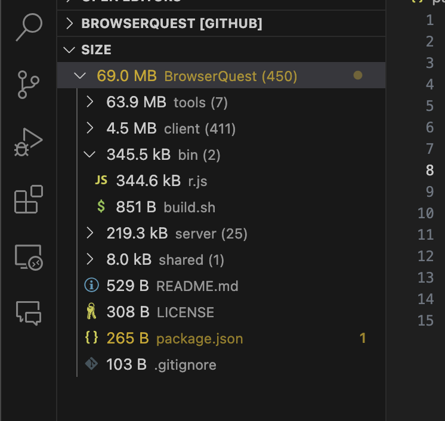

A simple yet astonishingly useful utility for VS Code and GitHub.  

## Motivation

Files and folders that are more important tend to be larger in size. You can get a good heuristic of what the repository is mostly about just by its allometrics.

This extension is compatible with (but not limited to) Remote Repositories and web builds of vscode. 
The original purpose was the ability to open any repository in [github.dev](https://github.dev) (hotkey: `.` on the repos page) to get a quick overview of the entire project in mere seconds.

should be a github feature tbh

## Features

* File system tree view, with **file sizes** and **file count** cumulative for all folders

* Flattened file list view, or grouped by file extension

* Powerful select / filter system
  
  Select files, folders and extensions to omit, exclude paths with regex, blacklist them, whitelist them, store and load from JSON, or never touch this feature, doesn't matter, it's there and it's extremely convienient

* Works with __remote repositories__

* Works in browser __[github.dev](https://github.dev)__ and __[vscode.dev](https://github.dev)__ (and other codium editors)

* In theory, supports any resource protocol / virtual file system provided by other extensions

## Settings

* `size.folderContentCount` - toggle file count for folders

* `size.compactFolders` - flatten folders that only contain one child

* `size.defaultTreeType` - sets default "View As..."

* `size.foldersFirst` - gives priority to folders when sorting even if folders are smaller than files

* `size.fileSizeUnits` - toggle between base-2 (Windows, ISO/IEC 80000-13) and base-10 (SI) file size units

* `size.fileSizeLabel` - whether to show file sizes as labels or as descriptions in a tree view

## Coming soon

More advanced filtering options

Similar explorer for document symbols size (à la document outline view), but count lines instead

Options to view and sort by file change rate, as reported by git log -- (inspired by [File Change Count](https://marketplace.visualstudio.com/items?itemName=sivakar12.file-change-count))

## Known Issues 

Files stored with Git LFS are not counted properly (worth parsing .gitattributes over?)

GitHub remote repositories are limited to 100,000 files (GitHub GraphQL API limitation)

**Enjoy!**
